# Hopfield Network Research Suite: Investigating Memory Through Classic and Modern Architectures

This repository is a Research Toolkit for simulating and visualizing the development of associative memory models. It implements and explores the progression from classic 1982 discrete neural models to the modern 2020 continuous architectures that underpin the self-attention mechanism used in today's Large Language Models (LLMs). It provides tools to tune parameters and identify the critical **tipping point** at which the network fails.

## Theoretical Foundations & Historical Eras

1. **1982 (Discrete):** Original Hebbian/Lyapunov model using bipolar states.
2. **1984 (Legacy Continuous):** Shift to graded responses and sigmoid activation functions.
3. **1985 (Projection Rule):** Introduction of the pseudo-inverse method to maximize capacity for non-orthogonal patterns. It is an "Engineering Peak" because it achieves perfect capacity ($\approx N$), but it is a **Global Rule** (non-local). 
4. **Mid-1980s (Asymmetric):** Development of sequence memory and temporal transitions.
5. **1997 (High-Capacity Discrete):** Integration of the Storkey Learning Rule to minimize pattern interference (crosstalk). It was developed as a **Local Rule** to achieve high capacity while remaining biologically plausible.
6. **2020 (Modern Continuous):** Transition to Log-Sum-Exp energy functions and self-attention mechanisms.<br><br>
    *Comparative breakdown of core Hopfield Network variants (1982–2020):* 

    | Feature | Hebbian (1982) | Storkey (1997) | Modern Continuous (2020) |
    | :--- | :--- | :--- | :--- |
    | **State Space** | Discrete Bipolar $\{-1, 1\}$ | Discrete Bipolar $\{-1, 1\}$ | Continuous $\mathbb{R}^n$ |
    | **Energy Function** | Quadratic form | Quadratic (Modified) | Log-Sum-Exp (LSE) |
    | **Storage Capacity** | $\approx 0.14N$ | $\approx 0.2N$ (improved over Hebbian) | Very high capacity (can exhibit near-exponential scaling in certain formulations) |
    | **Visual Output** | Black & White (Binary) | Black & White (Binary) | Continuous-valued representations |
    | **Update Rule** | Threshold (Sign Function) | Modified Local Field | Softmax-based weighted retrieval |
    | **Key Advantage** | Biological Simplicity | Reduced Crosstalk | Connection to Attention Mechanisms |

---

## Project Origin & Development Roles

This project originated at the **University of California, Davis** as part of the **COSMOS Summer 2025 program** within the **Mathematical Modeling of Biological Systems** cluster.

### 1. The COSMOS Foundation (Collaborative Phase)
The initial research and core engines were developed as a group project by **Allinah Zhan, Aryan Singh, Payton Hanks, and Sanjith Senthil**. During this phase, my (Allinah Z.) primary contributions included:

* **ClassicHopfieldNetworkFinal.R & HD+larger_image_decoder.R:** Key contributor. (Note: These were later refactored into the unified **ClassicHopfieldNetworkCore.R**).
* **ContinuousHopfieldNetwork.R:** Key contributor. (Note: This evolved into the current **ContinuousHopfieldNetworkCore.R**).
* **ColoredImageMemory.R:** Sole Author. Created the original RGB vectorization module to handle color data in a continuous state space.
* **correlationTests.R:** Sole Author. Created the initial analysis suite to investigate pattern interference, crosstalk, and capacity limits.

### 2. Independent Expansion & Refactoring (Developer: Allinah Z.)
Following the program, I independently re-engineered the project into a comprehensive research suite:

* **Engine Refactoring (Classic)**: Identified significant redundancy between legacy modules. I refactored and merged the logic from **`ClassicHopfieldNetworkFinal.R`** and **`HD+larger_image_decoder.R`** into **`ClassicHopfieldNetworkCore.R`**. This created a centralized engine for discrete associative memory that supports the **1982 Hebbian Rule**, the **1985 Projection Rule** (Pseudo-inverse), and the **1997 Storkey extension**.
* **Engine Refactoring (Continuous)**: Refactored the original **`ContinuousHopfieldNetwork.R`** code into **`ContinuousHopfieldNetworkCore.R`**. This engine implements both the **1984 legacy continuous model** and the **2020 Modern Hopfield Network (MHN)** logic, utilizing Log-Sum-Exp and Softmax-based Attention.
* **Creative Assets (Ground-Truth Patterns)**: I (Allinah Z.) use my original artwork, [**"AZ-Koala.jpg"**](assets/AZ-Koala.jpg), as the high-entropy ground-truth for neural recovery. Awarded [**Highly Commended (2025)**](https://explorersagainstextinction.co.uk/sketch-for-survival-junior-2025-finalists/) in the prestigious Sketch for Survival international competition—selected from 3,500+ entries representing 119 nationalities—it is featured in the 2025 Invitational Collection and available for sale via the [**Real World Store**](https://realworldstore.co.uk/products/allinah-zhan) to benefit global wildlife conservation. The "recovery" of this digital image mirrors real-world efforts to protect endangered populations from the "noise" of habitat loss.

* **The Gallery and Simulation Suite**: I authored a research suite of 3 scripts to benchmark network stability and identify failure thresholds. 

    **1. Classic Runners**

    * **Research Gallery (ClassicHopfieldGallery.R)**: A benchmarking engine to identify the network's **tipping point**. It generates 2x4 comparison grids across incremental noise levels to identify stability limits. Please refer to [**How to Use -> Classic Hopfield Gallery**](#classic-hopfield-gallery).
        * **Exhibit: Run `generate_classic_hopfield_gallery()` in R Console**
        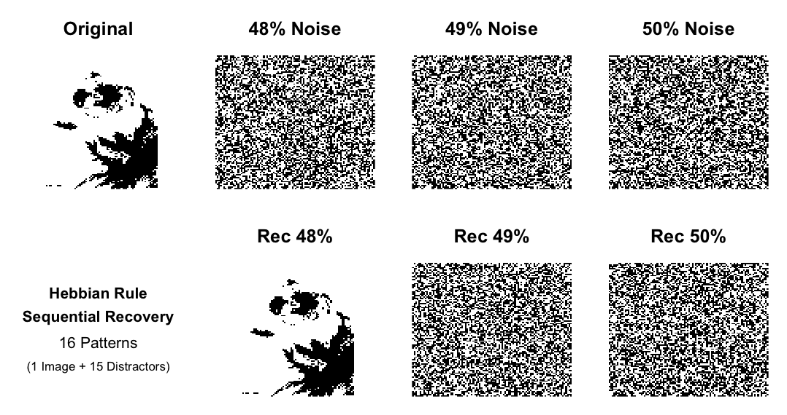       
           *Fig 1: At 49%, 50% noise, the network reaches a tipping point and is unable to recover the pattern (49% may recover in some instances).*

        * **Exhibit: Run `generate_classic_hopfield_gallery("Storkey","Random")` in R Console**
        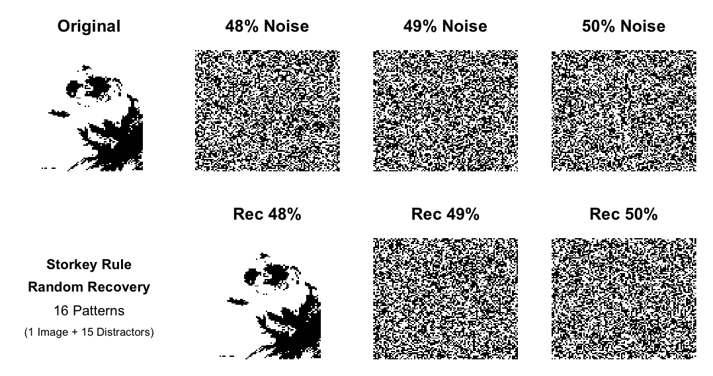
          *Fig 2: At 49%, 50% noise, the network reaches a tipping point and is unable to recover the pattern (49% may recover in some instances).*

        * **Exhibit: Run `generate_classic_hopfield_gallery(noise_1=0.51,noise_2=0.52,noise_3=1.0)` in R Console**
          
          *Fig 3: 51% noise, recovery fails; at 52% and 100% noise, the use of flip (bipolar inversion) for noise generation causes the network to settle into an inverse pattern (51% may recover in some instances).*

        * **Exhibit: Run `generate_classic_hopfield_gallery("Storkey","Random",noise_1=0.51,noise_2=0.52,noise_3=1.0)` in R Console**
        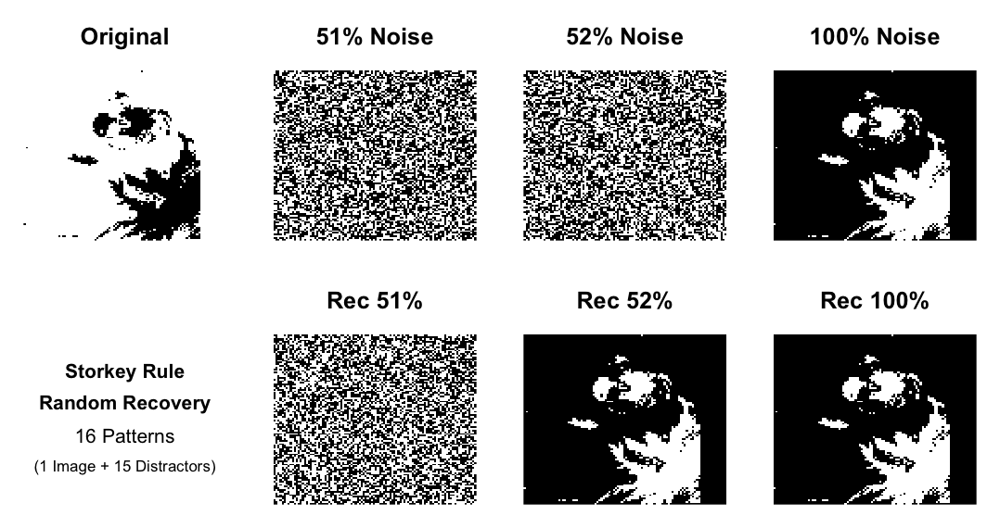  
          *Fig 4: 51% noise, recovery fails; at 75% and 100% noise, the use of `flip` (bipolar inversion) for noise generation causes the network to settle into an inverse pattern (51% may recover in some instances).*

    * **Dynamic Recovery (ClassicHopfieldSimulation.R)**: A real-time visualization tool to capture the step-by-step convergence of the network. It exports the energy minimization process as an animated GIF. Please refer to [**How to Use -> Run a Simulation (Real-time Recovery)**](#2-run-a-simulation-real-time-recovery).

        * **Exhibit: Run `simulate_classic_hopfield()` in R Console**
        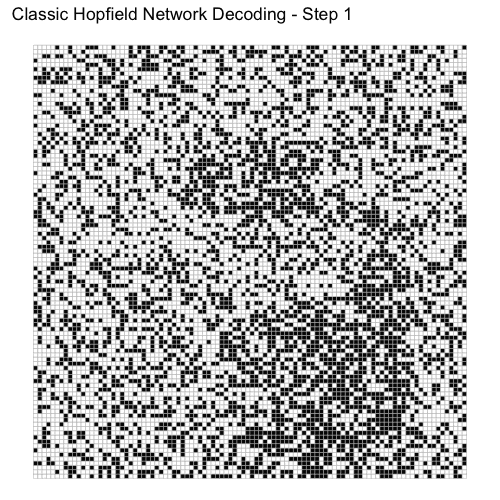
        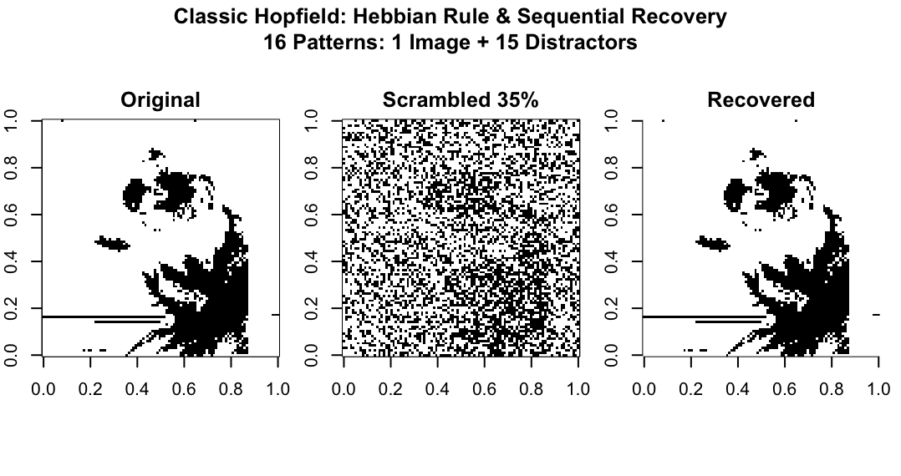
          *Fig 5 and 6: Animation of the Hebbian Sequential recovery process concluding with the Original, Scrambled, and Recovered patterns.*

        * **Exhibit: Run `simulate_classic_hopfield("Storkey","Random")` in R Console**
        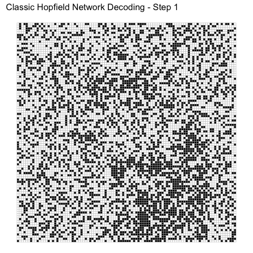
        
          *Fig 7 and 8: Animation of the energy descent process concluding with the Original, Scrambled, and Recovered states.*

    **2. Continuous Runner**

    * **Continuous Gallery (ContinuousHopfieldGallery.R)**: A benchmarking engine for the Modern Hopfield Network (MHN). This runner is fully parameterized, allowing users to adjust parameters to demonstrate the superior memory capacity of the continuous model and showcase how the inverse temperature parameter ($\beta$) controls the precision of the Softmax-based attention mechanism during recovery. Please refer to [**How to Use -> Modern Continuous Hopfield Gallery**](#modern-continuous-hopfield-gallery).
        * **Exhibit: Run `generate_mhn_gallery()` in R Console**
        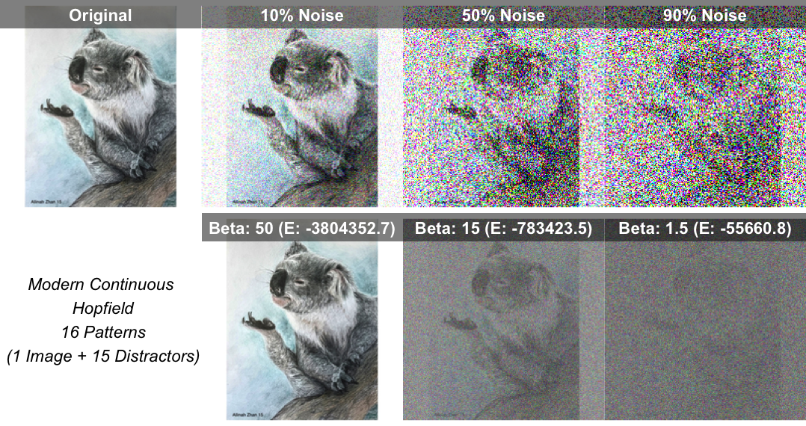
          *Fig 9: Benchmarking the Modern Hopfield Network; this gallery illustrates the transition from high-precision recovery (High $\beta$) to blurred state-averaging (Low $\beta$) across increasing noise levels using the "AZ-Koala.jpg" pattern.*    

* **Comparative Performance Analysis**: I authored `ClassicHopfieldHebbianStorkey.R` to demonstrate Storkey's superiority over legacy Hebbian learning.
        * **Exhibit: Benchmark Results**:
            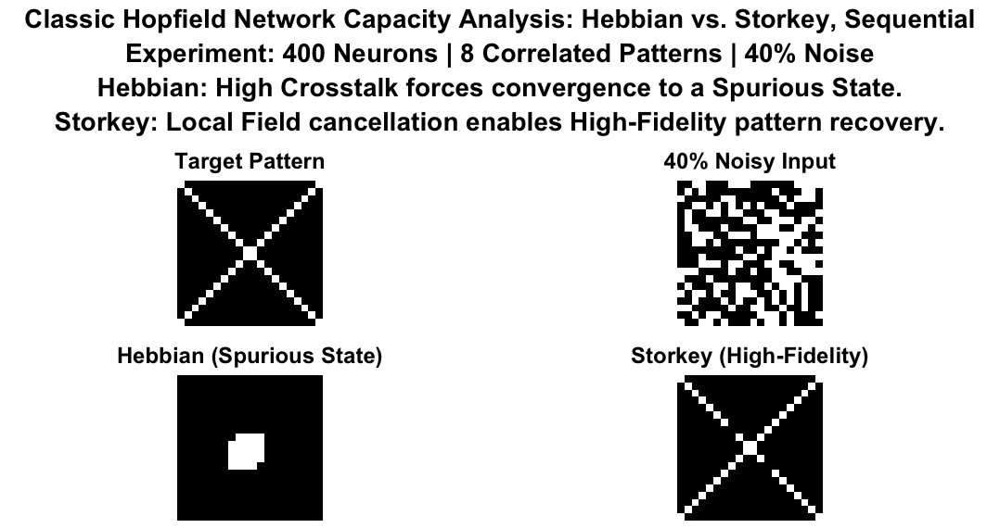
              *Fig 10: Hebbian failure (spurious state) vs Storkey high-fidelity recovery.*

* **Analytical Maintenance**: Adapted **`correlationTests.R`** to utilize the new unified core engines. By sourcing the script and executing `correlationClassicNetwork()` and `correlationContinuousNetwork()`, I conducted benchmarking of **storage limits** (Capacity Test) and **noise thresholds** (Resilience Test).
  
  #### 1. Classic Hopfield Network Benchmarking (`correlationClassicNetwork()`) This runner is fully parameterized, allowing users to adjust parameters. Please refer to [**How to Use -> correlationClassicNetwork Usage**](#correlationclassicnetwork-usage).
    * **Exhibit: Run `correlationClassicNetwork()`**
        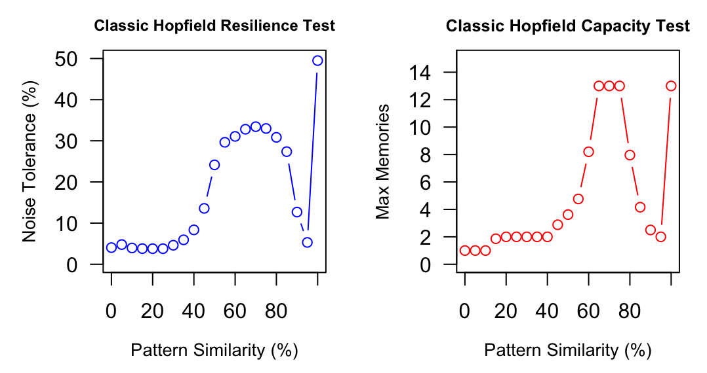
          *Fig 11: Resilience (blue) and Capacity (red) benchmarks for the Classic Hopfield **Storkey** rule.*
    * **Exhibit: Run `correlationClassicNetwork(learn_fn=fixed_weights_hebbian)`**
        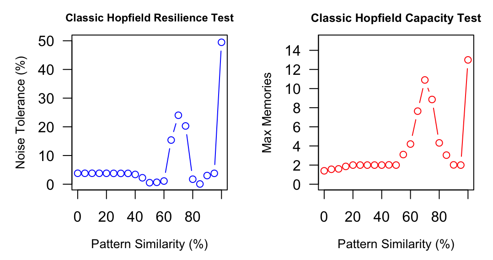
          *Fig 12: Resilience (blue) and Capacity (red) benchmarks for the Classic Hopfield **Hebbian** rule.*             
  #### 2. Modern Continuous Hopfield Network Benchmarking (`correlationContinuousNetwork()`) This runner is fully parameterized, allowing users to adjust parameters. Please refer to [**How to Use -> correlationContinuousNetwork Usage**](#correlationContinuousNetwork-usage).
    * **Exhibit: Run `correlationContinuousNetwork()`**
        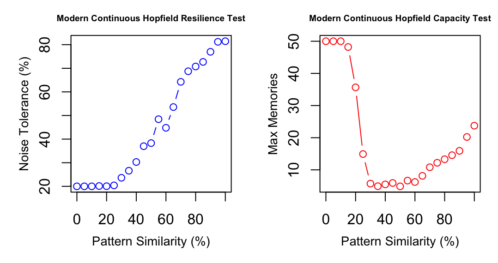
          *Fig 13: Resilience and Capacity tests for the Modern Continuous Core.*              

* **Dynamic File Ingestion**: Implemented a robust file selector across all runners. This removed hardcoded file paths, allowing users to dynamically select any `.jpg`, `.png`, or `.avif` for real-time testing.
* **GIF Generation Engine**: Designed and implemented a custom visualization pipeline using the 'magick' library that captures neural state transitions and exports them as GIFs.

* **Homogeneous Digit Stability Test (`ClassicHopfieldHomoDigitRec.R`)**: Evaluates the network's ability to maintain distinct sub-attractors within a single category.
    * **Logic**: The script trains the discrete core on a set of n distinct patterns from a single digit class (e.g., 5 different versions of the digit "3") using the **Storkey** rule. It then utilizes **Random** updates to see if the network can successfully converge to the specific target pattern despite the high similarity (low inter-pattern distance) of the other stored digits (). Please refer to [**How to Use -> Homogeneous Recognition**](#homogeneous-recognition). 
    * **Exhibit: Homogeneous Digit Recovery Results**
        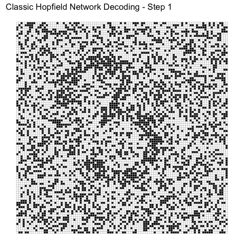
          *Fig 14A: Recovery animation for Digit 3.*
        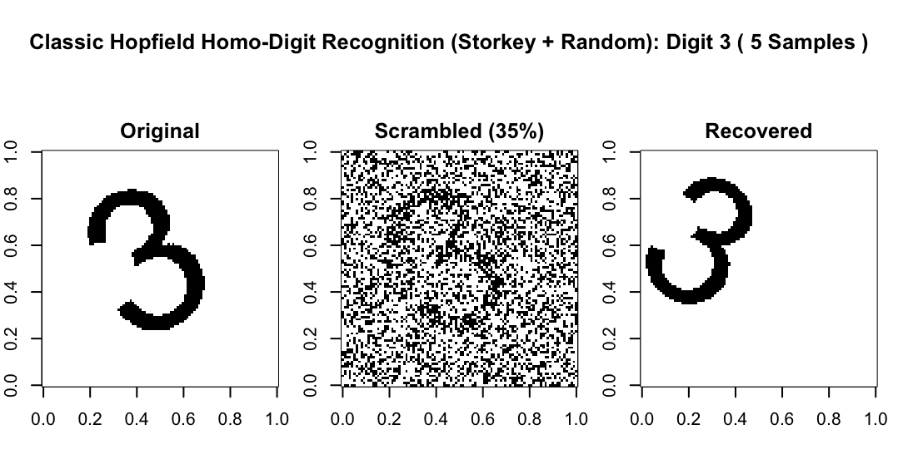
          *Fig 14B: Recovery result for Digit 3.*
        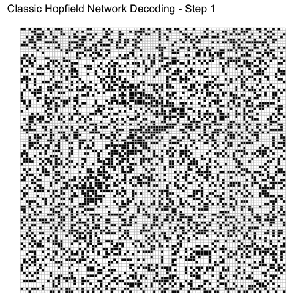
          *Fig 15A: Recovery animation for Digit 7.*          
        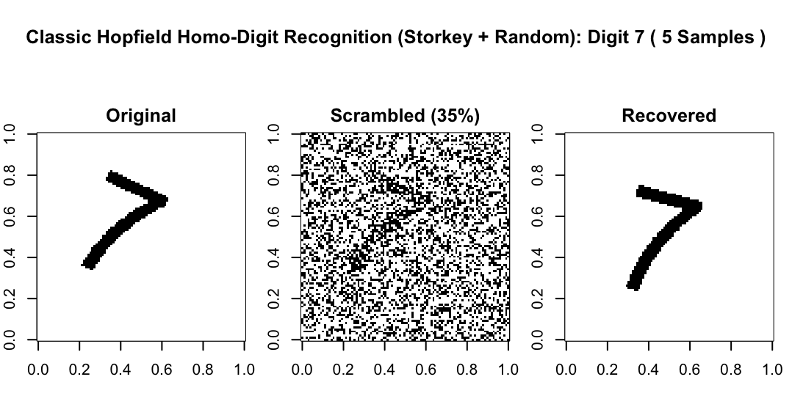
          *Fig 15B: Recovery result for Digit 7.*
* **High-Capacity Multi-Digit Stress Test (`hopfield_digit_full_with_report.R`)**: Refactored to push the discrete core to its limits using 50 distinct patterns. 
    * **Logic**: Implements the **1985 Projection Rule** (Pseudo-inverse) to decorrelate images, enabling the storage of up to $N$ patterns.
    * **Benchmark Findings**:

    | Test Metric | Run 1: Synchronous | Run 2: Random |
    | :--- | :--- | :--- |
    | **Noise Level** | 0.2 (20% flipped pixels) | 0.2 (20% flipped pixels) |
    | **Recovery Accuracy** | **100%** | **88%** |
    | **Avg. Convergence** | 2 steps | 100,000 steps |
    * **Exhibit: Projection Rule Recovery**
        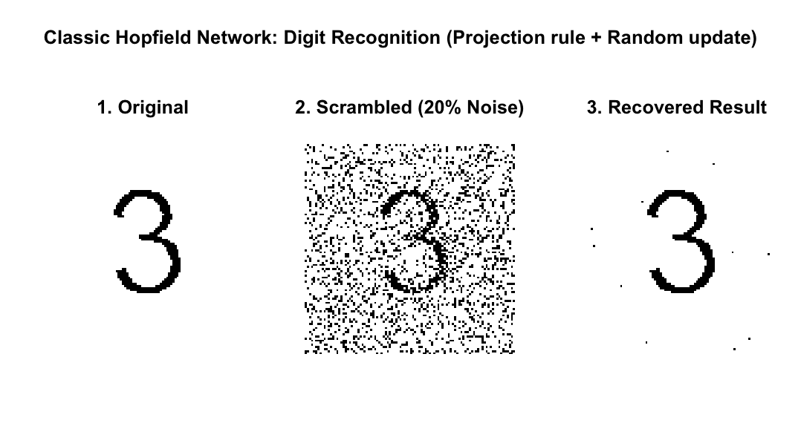
          *Fig 16: Successful recovery of digit '3' from a 50-pattern set using the Projection Rule.*
* **Modern Hopfield Network: Digit Recognition (`MHNDigitRecognition.R`)**: Refactored to utilize **`ContinuousHopfieldNetworkCore.R`** for formal MNIST classification.
    * **Exhibit: Digit Recognition Results**
        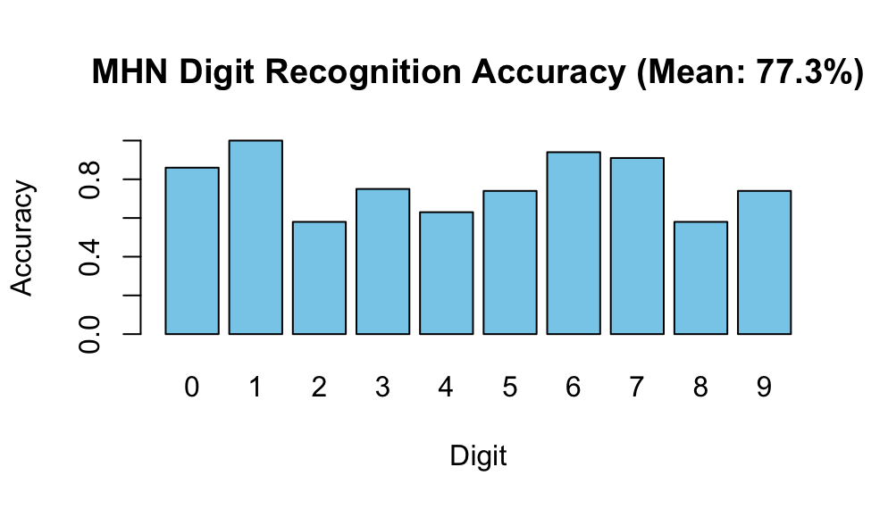
          *Fig 17: Recognition accuracy across MNIST digit classes.*
        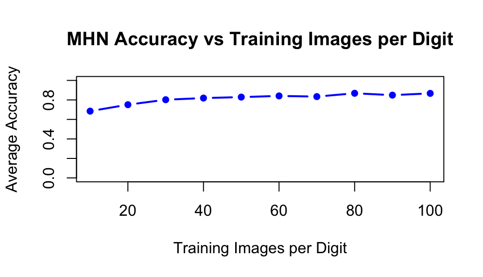
          *Fig 18: Scaling curve relative to training sample size.* 
* **Asymmetric Hopfield Network: Sequence Memory (`AHNMethods.R`)**: Refactored research module for temporal sequence recall and state-to-state transitions. Please refer to [**How to Use -> Sequence Memory Testing (Asymmetric Hopfield)**](#7-sequence-memory-testing-asymmetric-hopfield).
    * **Exhibit: Temporal Capacity Benchmarks**
        
          *Fig 19: Gradual Decay ($N=20$). Success rate begins to decline at a sequence length of 6, showing a typical "fading memory" effect.*
        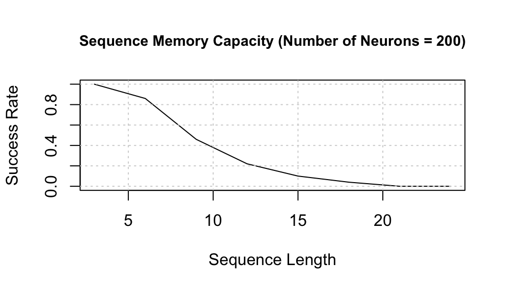
          *Fig 20: Consistent Capacity Wall ($N=200$). Despite a 10x increase in neurons, the network hits the same limit at length 6, following a similar decay gradient.*
        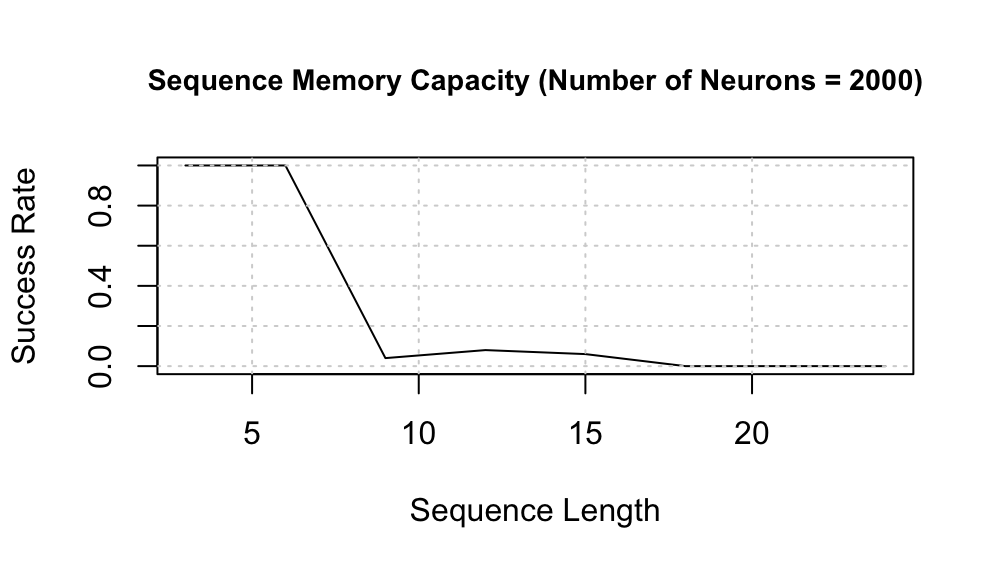
          *Fig 21: Sharp Phase Transition ($N=2000$). The network maintains perfect stability until length 6, followed by a "catastrophic collapse" where recall fails completely and instantly.*
* **Empirical Capacity Stress Test (`HopfieldHeatMap.R`)**: Refactored experimental harness for 3D mapping of storage limits.
    * **Exhibit: 3D Capacity Heatmap**
        * [**Interactive 3D Surface Map (`ClassicH_Capacity_3D.html`)**](results/ClassicH_Capacity_3D.html) (3D visualization of the empirical storage limits of the Classic Core.)

---

### Project Structure

| File / Folder | Type |
| :--- | :--- |
| **`core/`** | **Folder** |
| ↳ `ClassicHopfieldNetworkCore.R` | Core Engine |
| ↳ `ContinuousHopfieldNetworkCore.R` | Core Engine |
| **`utils/`** | **Folder** |
| ↳ `ColoredImageMemory.R` | Utility |
| **`ClassicHopfieldGallery.R`** | Experiment |
| **`ClassicHopfieldSimulation.R`** | Experiment |
| **`ContinuousHopfieldGallery.R`** | Experiment |
| **`ClassicHopfieldHomoDigitRec.R`** | Experiment |
| **`correlationTests.R`** | Experiment |
| **`hopfield_digit_full_with_report.R`** | Experiment |
| **`AHNMethods.R`** | Experiment |
| **`MHNDigitRecognition.R`** | Experiment |
| **`HopfieldHeatMap.R`** | Experiment |
| **`assets/`** | Folder |
| **`digits/`** | Folder |
| **`results/`** | Folder |

---

## Installation & Setup

**Ensure you have R installed.** This project is best experienced using **RStudio**.

1. **Set Working Directory**: To ensure relative paths for `assets/` and `digits/` function correctly, you must set your working directory to the project root. In RStudio:
    * In the **Files** pane, navigate into the project folder.
    * Click the blue gear icon ⚙️ and select **Set As Working Directory**.
    * *Alternative: You can also go to the top menu and select **Session > Set Working Directory > To Source File Location** while having one of the scripts open.*
2. **Install Dependencies**: This project relies on the following libraries for image processing, matrix math, and visualization:

    `install.packages(c("magick", "ggplot2", "gridExtra", "plotly", "htmlwidgets", "keras", "MASS"))`

    * **magick**: For image ingestion and generating `.gif` animations.
    * **parallel**: Utilized for optimized matrix operations (built into base R).
    * **grid**: Core graphics engine for layout generation (built into base R).
    * **ggplot2 / gridExtra**: For generating research galleries and comparison plots.
    * **plotly / htmlwidgets**: For rendering the interactive **ClassicH_Capacity_3D.html** surface maps.
    * **keras**: Used specifically for accessing the MNIST dataset within the digit recognition modules.
    * **MASS**: Required for the pseudo-inverse calculation in the **Projection Rule** engine.

    > **Note on Digit Recognition Setup**: The `keras` package requires a Python backend to access the MNIST dataset. After installing the package, you must initialize the engine by running the following commands in your R Console:
    > ```R
    > library(keras)
    > install_keras()
    > ```

---

## How to Use

### 1. Run a Research Gallery
#### **Classic Hopfield Gallery**
* **Source the Logic**: Open and source `ClassicHopfieldGallery.R`.
* **Execute Benchmarks**: The `generate_classic_hopfield_gallery` is parameterized, so you can call it in several ways in **R Console**:
    * **Minimum**: `generate_classic_hopfield_gallery()` (with all default parameters)
    * **Custom**: examples: `generate_classic_hopfield_gallery("Storkey", "Random", 0.05, 0.25, 0.45, 20)`;     `generate_classic_hopfield_gallery(noise_1 = 0.2, noise_2 = 0.4, noise_3 = 0.6)`
        | Parameter | Options / Type | Default |
        | :--- | :--- | :--- |
        | **`learning_rule`** | `"Hebbian"`, `"Storkey"` | `"Hebbian"` |
        | **`recovery_mode`** | `"Sequential"`, `"Random"`, `"Sync"` | `"Sequential"` |
        | **`noise_1, noise_2, noise_3`** | `Float [0, 1]` | `0.48, 0.49, 0.5` |
        | **`num_distractors`** | `Integer >= 0` | `15` |
    * **Select an Image**: A native file dialog will prompt you to select an image. If the selection is cancelled, the system defaults to [`AZ-Koala.jpg`](assets/AZ-Koala.jpg).
* **Check Outputs**: 
    * A 2x4 grid rendered in **R Plot** window.    
#### **Modern Continuous Hopfield Gallery**
* **Source the Logic**: Open and source `ContinuousHopfieldGallery.R`.
* **Execute Benchmarks**: The `generate_mhn_gallery` is parameterized, so you can call it in several ways in **R Console**:
    * **Minimum**: `generate_mhn_gallery()` (with all default parameters)
    * **Custom**: examples: `generate_mhn_gallery(0.05, 0.45, 0.85, 55, 20, 2, 20)`; `generate_mhn_gallery(beta_1 = 100, num_distractors = 5)`
        | Parameter | Options / Type | Default |
        | :--- | :--- | :--- |
        | **`noise_1, noise_2, noise_3`** | `Float [0, 1]` | `0.1, 0.5, 0.9` |
        | **`beta_1, beta_2, beta_3`** | `Float > 0` | `50, 15, 1.5` |
        | **`num_distractors`** | `Integer >= 0` | `15` |
    * **Select an Image**: A native file dialog will prompt you to select an image. If the selection is cancelled, the system defaults to [`AZ-Koala.jpg`](assets/AZ-Koala.jpg).  
* **Check Outputs**: 
    * A 2x4 grid rendered in **R Plot** window.  

### 2. Run a Simulation (Real-time Recovery)

> **Note**: This simulation mode is designed specifically for **Classic Hopfield** models to visualize iterative, discrete state transitions. Unlike Modern Continuous networks—which tend to converge to a fixed point in a few iterations due to their high-precision energy basins—the Classic models provide a rich, step-by-step visualization of energy minimization.

* **Source the Logic**: Open and source `ClassicHopfieldSimulation.R`.
* **Execute Simulation**: The `simulate_classic_hopfield` is parameterized, so you can call it in several ways in **R Console**:
    * **Minimum**: `simulate_classic_hopfield()` (with all default parameters)
    * **Custom**: examples: `simulate_classic_hopfield("Storkey", "Sync", 0.5, 20)`; `simulate_classic_hopfield(learning_rule = "Storkey", noise_frac = 0.5)`

        | Parameter | Options / Type | Default |
        | :--- | :--- | :--- |
        | **`learning_rule`** | `"Hebbian"`, `"Storkey"` | `"Hebbian"` |
        | **`recovery_mode`** | `"Sequential"`, `"Random"`, `"Sync"` | `"Sequential"` |
        | **`noise_frac`** | `Float [0, 1]` | `0.35` |
        | **`num_distractors`** | `Integer >= 0` | `15` |
    * **Select an Image**: A native file dialog will prompt you to select an image. If the selection is cancelled, the system defaults to [`AZ-Koala.jpg`](assets/AZ-Koala.jpg). 
* **Check Outputs**:
    * A `.gif` file (e.g., `recovery_classic_hebbian_sequential.gif`) is automatically saved to your **working directory**.
    * R Plot
    * R Console  

### 3. Rule Comparison Benchmarking (Hebbian vs. Storkey)
* Open and source `ClassicHopfieldHebbianStorkey.R`.
* **Head-to-Head**: This script runs the same corrupted pattern through both the Hebbian and Storkey learning rules simultaneously.
* **Performance Analysis**: Use this to compare Hebbian's failure versus Storkey's recovery.
* **Check Outputs**:
    * R Plot
    * R Console

### 4. Run Performance Analysis (Resilience & Capacity)
* Open `correlationTests.R` and source the file.
    <a id="correlationclassicnetwork-usage"></a>
    * **`correlationClassicNetwork` Usage**: It is parameterized, so you can call it in several ways in **R Console**:<br>
        * **Minimum**: `correlationClassicNetwork()` (with all default parameters)
        * **Custom**: examples: `correlationClassicNetwork(seq(0, 80, by=10), 15, 15, 10, 75, 1500, simulate_until_fixed_sequential, fixed_weights_hebbian, 0.1)`; `correlationClassicNetwork(patternCount = 15, learn_fn = fixed_weights_hebbian, stability_threshold = 0.1)`

            | Parameter | Options / Type | Default |
            | :--- | :--- | :--- |
            | **`correlationLevels`** | Numeric sequence (correlation values to test) | `seq(0, 100, by = 5)` |
            | **`x`** | `Integer > 0` (width of pattern matrix) | `10` |
            | **`y`** | `Integer > 0` (height of pattern matrix) | `10` |
            | **`patternCount`** | `Integer >= 0` (number of stored patterns to test capacity) | `13` |
            | **`trials`** | `Integer > 0` (number of trials per correlation level) | `50` |
            | **`steps`** | `Integer > 0` (max update steps per trial) | `1000` |
            | **`update_fn`** | Update function (`simulate_until_fixed_random`, `simulate_until_fixed_sync`, `simulate_until_fixed_sequential`) | `simulate_until_fixed_random` |
            | **`learn_fn`** | Learning function (`fixed_weights_storkey`, `fixed_weights_hebbian`) | `fixed_weights_storkey` |
            | **`stability_threshold`** | `Float [0, 1]` (threshold for convergence stability) | `0.05` |
    <a id="correlationContinuousNetwork-usage"></a>            
    * **`correlationContinuousNetwork` Usage**: It is parameterized, so you can call it in several ways in **R Console**:
        * **Minimum**: `correlationContinuousNetwork()` (with all default parameters)
        * **Custom**: examples: `correlationContinuousNetwork(seq(0, 90, by=10), 8, 8, 8, 75, 1500, 30)`; `correlationContinuousNetwork(patternCount = 10, beta = 15, trials = 60)`

            | Parameter | Options / Type | Default |
            | :--- | :--- | :--- |
            | **`correlationLevels`** | Numeric sequence (correlation values to test) | `seq(0, 100, by = 5)` |
            | **`x`** | `Integer > 0` (width of pattern matrix for continuous engine) | `5` |
            | **`y`** | `Integer > 0` (height of pattern matrix for continuous engine) | `5` |
            | **`patternCount`** | `Integer >= 0` (number of stored patterns to test capacity) | `5` |
            | **`trials`** | `Integer > 0` (number of trials per correlation level) | `50` |
            | **`steps`** | `Integer > 0` (max update steps per trial) | `1000` |
            | **`beta`** | `Float > 0` (inverse temperature parameter for Softmax attention) | `20` |
* **Understanding the Plots**:
    * **Resilience Test**: Measures the maximum noise percentage (perturbation) the network can tolerate before it fails to distinguish between similar stored memories.
    * **Capacity Test**: Benchmarks the "Max Memories" the network can stably store as pattern similarity increases before spurious states dominate.
* **Check Outputs**:
    * R Plot
    * R Console

### 5. Digit Recognition
* **MNIST Recognition**: Run `MHNDigitRecognition.R` to evaluate the Modern Continuous Core’s ability to classify handwritten digits (from MNIST).
    * **Check Outputs**:
        * R Plot
        * R Console
* **50-Pattern Stress Test (Projection Rule)**: Run `hopfield_digit_full_with_report.R` to test high-capacity recovery using pseudo-inverse weights across all digit classes. The script generates 20 PNGs per digit (stored in the /digits folder) to establish the testing baseline before executing the recovery benchmarks.
    * **Check Outputs**:
        * A `.gif` file (e.g., `ClassicH_ProjectionRandom_Digit_3.gif`) is automatically saved to your **working directory**.
        * R Plot
        * R Console
<a id="homogeneous-recognition"></a>
* **Homogeneous Digit Recognition**: To test the stability of sub-attractors within the same digit class using the Storkey rule, first `source("ClassicHopfieldHomoDigitRec.R")`.
    * **Execute Benchmarks**: The `run_digit_test` is parameterized, so you can call it in several ways :
        * **Minimum**: e.g., `run_digit_test(3)` (uses default `num_patterns` and `frac_scramble`)
        * **Custom**: examples: `run_digit_test(3, 10, 0.3)`; `run_digit_test(3, frac_scramble = 0.5)`
            | Parameter | Options / Type | Default |
            | :--- | :--- | :--- |
            | **`digit_to_test`** | `Integer [0-9]` | *Required* |
            | **`num_patterns`** | `Integer > 0` | `5` |
            | **`frac_scramble`** | `Float [0, 1]` | `0.35` |
    * **Check Outputs**:
        * A `.gif` file (e.g., `recovery_homo_digit_3.gif`) is automatically saved to your **working directory**.
        * R Plot.
        * R Console

### 6. 3D Heatmap
* **3D Capacity Mapping**: Run `HopfieldHeatMap.R` to generate an interactive 3D surface. This script stress-tests the Classic Core across varying sizes and densities, 
* **Check Outputs**: 
  * `ClassicH_Capacity_3D.html` is saved to your **working directory**, and it opens in your default browser.

### 7. Sequence Memory Testing (Asymmetric Hopfield)
* **Source the Logic**: Open and source `AHNMethods.R`.
* **Execute Benchmarks**: The `sequence_capacity_test` is parameterized, so you can call it in several ways:
    * **Minimum**: e.g., `sequence_capacity_test(20)` (uses default `max_length` and `trials`)
    * **Custom**: examples: `sequence_capacity_test(200, 30, 100)`; `sequence_capacity_test(50, trials = 200)`
        | Parameter | Options / Type | Default |
        | :--- | :--- | :--- |
        | **`num_nodes`** | `Integer > 0` | *Required* |
        | **`max_length`** | `Integer > 0` | `25` |
        | **`trials`** | `Integer > 0` | `50` |
* **Check Outputs**:
    * R plot
    * R console

---

## License & Usage

This repository contains a combination of collaborative work from the UC Davis COSMOS program and independent expansion/refactoring. At this time, the project is shared for **educational and review purposes only**. No explicit license is granted for commercial use or redistribution.